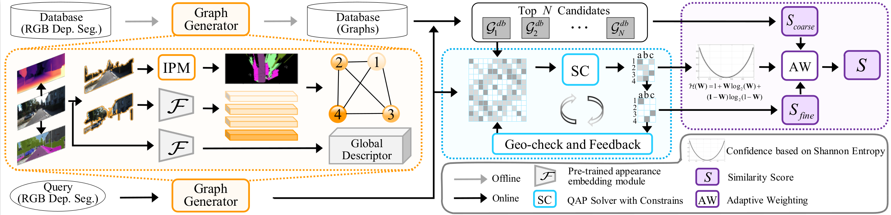

# BEVGM: A Visual Place Recognition Method with Bird's Eye View Graph Matching

Public code of "[BEVGM: A Visual Place Recognition Method With Bird's Eye View Graph Matching](https://ieeexplore.ieee.org/document/10502165)", which is accepted by RAL 2024.




## Quick Start

### Dependencies

+ python==3.8
+ pytorch==1.10.1
+ networkx=2.8.6
+ pygmtools=0.3.1
+ linsatnet=0.0.6
+ faiss
+ pyquaternion
+ matplotlib
+ opencv
+ scikit-learn
+ pyyaml
+ shapely
+ tqdm

### Preprocess

+ Depth estimation: [Lite-Mono](https://github.com/noahzn/Lite-Mono)
  + model: `lite-mono-8m (1024x320)`
+ Semantic segmentation: [OneFormer](https://github.com/SHI-Labs/OneFormer)
  + config: `oneformer_convnext_large_bs16_90k.yaml` 

+ Dataset: [The SYNTHIA dataset](https://synthia-dataset.net/)
  + springB: `/your/dataset/path/SYNTHIA/SYNTHIA_VIDEO_SEQUENCES/SYNTHIA-SEQS-02-DAWN/RGB/Stereo_Left/ /Omin_B/{000000.png~000699.png}`
  + dawnF:  `/your/dataset/path/SYNTHIA/SYNTHIA_VIDEO_SEQUENCES/SYNTHIA-SEQS-02-DAWN/RGB/Stereo_Left/Omni_F/{000000.png~000699.png}) `

### Usage

1. Generate query-dataset pair

```shell
python script/gen_pair_unity.py
```

2. Generate BEV graphs

```shell
./script/synthia_graph.sh
```

3. Match BEV graphs

```shell
./script/synthia_match.sh
```

4. Eval

```shell
python script/eval_all.py -e SYNTHIA_springB_dawnF -p your/match/result/path
```

## Files

TODO

## Citation

BibTex

> @ARTICLE{10502165,
>     author={Niu, Haochen and Liu, Peilin and Ji, Xingwu and Zhang, Lantao and Ying, Rendong and Wen, Fei},
>     journal={IEEE Robotics and Automation Letters}, 
>     title={BEVGM: A Visual Place Recognition Method With Bird's Eye View Graph Matching}, 
>     year={2024},
>     volume={9},
>     number={6},
>     pages={5142-5149},
>     doi={10.1109/LRA.2024.3389610}}

Plain Text

> H. Niu, P. Liu, X. Ji, L. Zhang, R. Ying and F. Wen, "BEVGM: A Visual Place Recognition Method With Bird's Eye View Graph Matching," in IEEE Robotics and Automation Letters, vol. 9, no. 6, pp. 5142-5149, June 2024, doi: 10.1109/LRA.2024.3389610.
